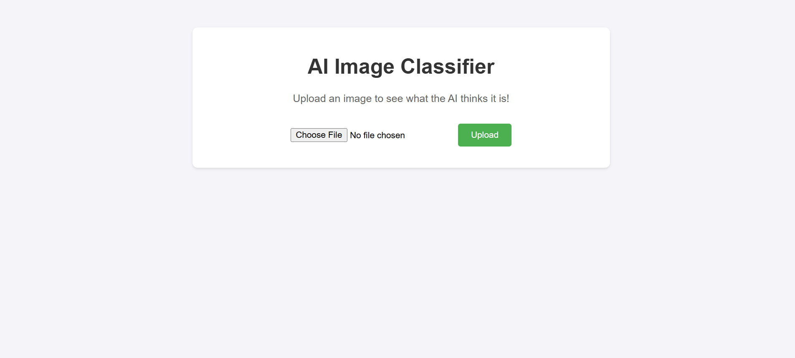
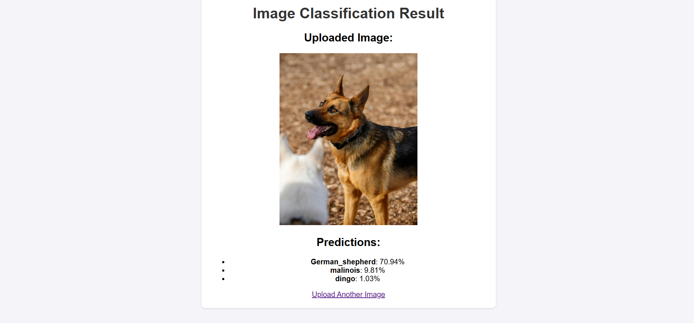

# 🖼️ AI Image Classifier

Welcome to the **AI Image Classifier** project! This application allows users to upload images and see what the AI predicts the image contains. It uses **Flask** for the back-end and **TensorFlow** for image classification.

## 🖼️ Project Preview

### 🏠 Home Page



### 🖼️ Prediction Result



## 📋 Project Features

- Upload and process images.
- Receive top 3 predictions for the uploaded image.
- Simple and interactive web interface.
- Local deployment using Flask.

## 🛠️ Technologies Used

- Python
- Flask for the back-end
- TensorFlow for image classification

## 📂 Project Structure

```
image_classifier_project/
├── app/
│   ├── __init__.py         # App initialization
│   ├── app.py              # Main application script
│   ├── model/
│   │   ├── __init__.py     # Model package
│   │   └── train_model.py  # Model loading and prediction logic
│   ├── static/
│   │   └── style.css       # CSS for styling
│   └── templates/
│       └── result.html     # HTML templates
├── requirements.txt        # Dependencies for the project
├── .gitignore              # Git ignore rules
├── venv/                   # Virtual environment (optional)
└── README.md               # Project documentation
```

## ⚙️ Installation and Setup

Follow these steps to run the project locally:

### 1️⃣ Clone the Repository

```bash
git clone https://github.com/plavsic-marko/image_classifier_project.git
cd image_classifier_project
```

### 2️⃣ Set Up a Virtual Environment (optional but recommended)

```bash
python -m venv venv
source venv/bin/activate   # On Linux/Mac
venv\Scripts\activate     # On Windows
```

### 3️⃣ Install Dependencies

```bash
pip install -r requirements.txt
```

### 4️⃣ Run the Application

```bash
python app/app.py
```

The application will run locally, and you can access it at:

[http://127.0.0.1:5000](http://127.0.0.1:5000)

## 🧪 Usage

1. Go to [http://127.0.0.1:5000](http://127.0.0.1:5000).
2. Upload an image using the provided interface.
3. See the top 3 predictions generated by the AI model.

## 🚀 Deploy to GitHub

To deploy this project to GitHub:

1. Create a new repository on GitHub.
2. Add all files to your local repository:
   ```bash
   git add .
   git commit -m "Initial commit"
   git branch -M main
   git remote add origin https://github.com/plavsic-marko/image_classifier_project.git
   git push -u origin main
   ```

## 📄 License

This project is licensed under the **MIT License**. Feel free to modify and distribute it as you like.

## 🙋 Contributing

Contributions are welcome! Feel free to open issues or submit pull requests.

## 📞 Contact

If you have any questions or need further assistance, feel free to reach out:

- **Name:** Marko
- **Email:** plavsicmarko10@gmail.com
- **GitHub:** [https://github.com/plavsic-marko](https://github.com/plavsic-marko)
